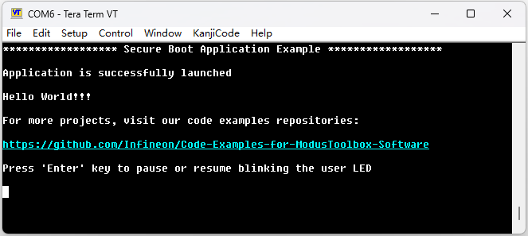
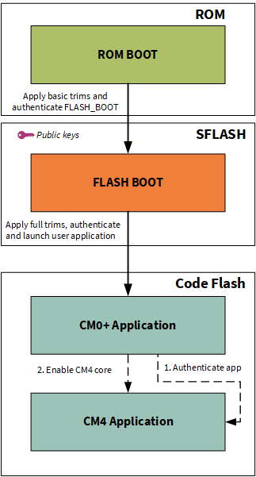

# XMC5000: Secure boot application

This code example showcases the secure boot capability of the XMC5000 MCU. With secure boot enabled, the BootROM validates the authenticity of the application image before transferring execution, ensuring only trusted firmware is launched.

In this code example, the MCU flash bootloader, which is first verified by the BootROM and is therefore trusted, verifies the CM0+ firmware. After booting, the CM0+ firmware verifies the CM4 firmware and enables its execution only if the signature is valid.

The CM4 firmware in this code example builds upon the implementation of the Hello world code example. For more information, see the [Hello world](https://github.com/Infineon/mtb-example-ce240757-hello-world) code example.

[View this README on GitHub.](https://github.com/Infineon/mtb-example-ce243389-secure-boot)

[Provide feedback on this code example.](https://yourvoice.infineon.com/jfe/form/SV_1NTns53sK2yiljn?Q_EED=eyJVbmlxdWUgRG9jIElkIjoiQ0UyNDMzODkiLCJTcGVjIE51bWJlciI6IjAwMi00MzM4OSIsIkRvYyBUaXRsZSI6IlhNQzUwMDA6IFNlY3VyZSBib290IGFwcGxpY2F0aW9uIiwicmlkIjoiZGF2aWQuenVvQGluZmluZW9uLmNvbSIsIkRvYyB2ZXJzaW9uIjoiMS4wLjAiLCJEb2MgTGFuZ3VhZ2UiOiJFbmdsaXNoIiwiRG9jIERpdmlzaW9uIjoiTUNEIiwiRG9jIEJVIjoiSUNXIiwiRG9jIEZhbWlseSI6IlBTT0MifQ==)


## Requirements

- [ModusToolbox&trade;](https://www.infineon.com/modustoolbox) v3.8 or later (tested with v3.8)
- Board support package (BSP) minimum required version:
    - KIT_XMC52_EVK – 1.0.0
- Programming language: C
- Associated parts: All [XMC5000 MCUs](https://www.infineon.com/products/microcontroller/32bit-industrial-arm-cortex-m/xmc5000)


## Supported toolchains (make variable 'TOOLCHAIN')

- GNU Arm&reg; Embedded Compiler v14.2.1 (`GCC_ARM`) – Default value of `TOOLCHAIN`


## Supported kits (make variable 'TARGET')

- [XMC5200 Evaluation Kit](https://www.infineon.com/evaluation-board/KIT-XMC52-EVK) (`KIT_XMC52_EVK`) - Default value of `TARGET`


## Hardware setup

This example uses the board's default configuration. See the kit user guide to ensure that the board is configured correctly.


## Software setup

See the [ModusToolbox&trade; tools package installation guide](https://www.infineon.com/ModusToolboxInstallguide) for information about installing and configuring the tools package.

Install a terminal emulator if you do not have one. Instructions in this document use [Tera Term](https://teratermproject.github.io/index-en.html).


## Using the code example


### Create the project

The ModusToolbox&trade; tools package provides the Project Creator as both a GUI tool and a command line tool.

<details><summary><b>Use Project Creator GUI</b></summary>

1. Open the Project Creator GUI tool

   There are several ways to do this, including launching it from the dashboard or from inside the Eclipse IDE. For more details, see the [Project Creator user guide](https://www.infineon.com/ModusToolboxProjectCreator) (locally available at *{ModusToolbox&trade; install directory}/tools_{version}/project-creator/docs/project-creator.pdf*)

2. On the **Choose Board Support Package (BSP)** page, select a kit supported by this code example. See [Supported kits](#supported-kits-make-variable-target)

   > **Note:** To use this code example for a kit not listed here, you may need to update the source files. If the kit does not have the required resources, the application may not work

3. On the **Select Application** page:

   a. Select the **Application(s) Root Path** and the **Target IDE**

      > **Note:** Depending on how you open the Project Creator tool, these fields may be pre-selected for you

   b. Select this code example from the list by enabling its check box

      > **Note:** You can narrow the list of displayed examples by typing in the filter box

   c. (Optional) Change the suggested **New Application Name** and **New BSP Name**

   d. Click **Create** to complete the application creation process

</details>

<details><summary><b>Use Project Creator CLI</b></summary>

The 'project-creator-cli' tool can be used to create applications from a CLI terminal or from within batch files or shell scripts. This tool is available in the *{ModusToolbox&trade; install directory}/tools_{version}/project-creator/* directory.

Use a CLI terminal to invoke the 'project-creator-cli' tool. On Windows, use the command-line 'modus-shell' program provided in the ModusToolbox&trade; installation instead of a standard Windows command-line application. This shell provides access to all ModusToolbox&trade; tools. You can access it by typing "modus-shell" in the search box in the Windows menu. In Linux and macOS, you can use any terminal application.

The following example clones the "[Secure boot](https://github.com/Infineon/mtb-example-ce243389-secure-boot)" application with the desired name "SecureBoot" configured for the *KIT_XMC52_EVK* BSP into the specified working directory, *C:/mtb_projects*:

   ```
   project-creator-cli --board-id KIT_XMC52_EVK --app-id mtb-example-ce243389-secure-boot --user-app-name SecureBoot --target-dir "C:/mtb_projects"
   ```

The 'project-creator-cli' tool has the following arguments:

Argument | Description | Required/optional
---------|-------------|-----------
`--board-id` | Defined in the <id> field of the [BSP](https://github.com/Infineon?q=bsp-manifest&type=&language=&sort=) manifest | Required
`--app-id`   | Defined in the <id> field of the [CE](https://github.com/Infineon?q=ce-manifest&type=&language=&sort=) manifest | Required
`--target-dir`| Specify the directory in which the application is to be created if you prefer not to use the default current working directory | Optional
`--user-app-name`| Specify the name of the application if you prefer to have a name other than the example's default name | Optional

<br>

> **Note:** The project-creator-cli tool uses the `git clone` and `make getlibs` commands to fetch the repository and import the required libraries. For details, see the "Project creator tools" section of the [ModusToolbox&trade; tools package user guide](https://www.infineon.com/ModusToolboxUserGuide) (locally available at {ModusToolbox&trade; install directory}/docs_{version}/mtb_user_guide.pdf).

</details>


### Open the project

After the project has been created, you can open it in your preferred development environment.


<details><summary><b>Eclipse IDE</b></summary>

If you opened the Project Creator tool from the included Eclipse IDE, the project will open in Eclipse automatically.

For more details, see the [Eclipse IDE for ModusToolbox&trade; user guide](https://www.infineon.com/MTBEclipseIDEUserGuide) (locally available at *{ModusToolbox&trade; install directory}/docs_{version}/mt_ide_user_guide.pdf*).

</details>


<details><summary><b>Visual Studio (VS) Code</b></summary>

Launch VS Code manually, and then open the generated *{project-name}.code-workspace* file located in the project directory.

For more details, see the [Visual Studio Code for ModusToolbox&trade; user guide](https://www.infineon.com/MTBVSCodeUserGuide) (locally available at *{ModusToolbox&trade; install directory}/docs_{version}/mt_vscode_user_guide.pdf*).

</details>


<details><summary><b>Arm&reg; Keil&reg; µVision&reg;</b></summary>

Double-click the generated *{project-name}.cprj* file to launch the Keil&reg; µVision&reg; IDE.

For more details, see the [Arm&reg; Keil&reg; µVision&reg; for ModusToolbox&trade; user guide](https://www.infineon.com/MTBuVisionUserGuide) (locally available at *{ModusToolbox&trade; install directory}/docs_{version}/mt_uvision_user_guide.pdf*).

</details>


<details><summary><b>IAR Embedded Workbench</b></summary>

Open IAR Embedded Workbench manually, and create a new project. Then select the generated *{project-name}.ipcf* file located in the project directory.

For more details, see the [IAR Embedded Workbench for ModusToolbox&trade; user guide](https://www.infineon.com/MTBIARUserGuide) (locally available at *{ModusToolbox&trade; install directory}/docs_{version}/mt_iar_user_guide.pdf*).

</details>


<details><summary><b>Command line</b></summary>

If you prefer to use the CLI, open the appropriate terminal, and navigate to the project directory. On Windows, use the command-line 'modus-shell' program; on Linux and macOS, you can use any terminal application. From there, you can run various `make` commands.

For more details, see the [ModusToolbox&trade; tools package user guide](https://www.infineon.com/ModusToolboxUserGuide) (locally available at *{ModusToolbox&trade; install directory}/docs_{version}/mtb_user_guide.pdf*).

</details>


## Operation

1. Connect the board to your PC using the provided USB cable through the KitProg3 USB connector

2. Open a terminal program and select the KitProg3 COM port. Set the serial port parameters to 8N1 and 115200 baud

3. Program the board using one of the following:

   <details><summary><b>Using Eclipse IDE</b></summary>

      1. Select the application project in the Project Explorer

      2. In the **Quick Panel**, scroll down, and click **\<Application Name> Program (KitProg3_MiniProg4)**
   </details>


   <details><summary><b>In other IDEs</b></summary>

   Follow the instructions in your preferred IDE

   </details>


   <details><summary><b>Using CLI</b></summary>

     From the terminal, execute the `make program` command to build and program the application using the default toolchain to the default target. The default toolchain is specified in the application's Makefile but you can override this value manually:
      ```
      make program TOOLCHAIN=<toolchain>
      ```

      Example:
      ```
      make program TOOLCHAIN=GCC_ARM
      ```
   </details>

4. After programming, the application starts automatically. Confirm that "Secure Boot Application Example" is displayed on the UART terminal

    **Figure 1.  Terminal output on program startup**

    

5. Confirm that the kit LED1 blinks at approximately 1 Hz. In this code example, pressing the Enter key stops LED1 from blinking, and pressing Enter again resumes blinking

6. Open the **Makefile** file of **proj_cm4** project and modify the signing private key in POSTBUILD from test_private_key_0.pem to test_private_key_1.pem, then follow **Step 3**

7. After programming, confirm that kit LED2 blinks rapidly, indicating that CM4 firmware verification by the CM0+ firmware has failed


## Debugging

You can debug the example to step through the code.

<details><summary><b>In Eclipse IDE</b></summary>

Use the **\<Application Name> Debug (KitProg3_MiniProg4)** configuration in the **Quick Panel**. For details, see the "Program and debug" section in the [Eclipse IDE for ModusToolbox&trade; user guide](https://www.infineon.com/MTBEclipseIDEUserGuide).

</details>


<details><summary><b>In other IDEs</b></summary>

Follow the instructions in your preferred IDE.

</details>


## Design and implementation

To keep the system in a fully secure state, the device life cycle stage must be transitioned to SECURE (or SECURE_W_DEBUG) and rewriting of the supervisory flash (SFLASH) must be prohibited.

However, this code example assumes that the device life cycle stage is NORMAL_PROVISIONED and demonstrates how the contents of the SFLASH are configured. This code example also explains how to assign digital signatures to CM0+ and CM4 firmware images, how those signatures are verified, and how the CM0+ firmware verifies the CM4 firmware.


### TOC2 configuration

The TOC2 is prepared as a constant table *cy_toc2* in the *secure_boot_config.c* of CM0+ firmware, and must be placed at the specified address (0x17007C00) in SFLASH.
- The elements in TOC2 to keep in mind to configure a secure boot:
    - *.appAddr1*   <BR> Top address of the application to be verified by flash boot. In this code example, the top address of CM0+ firmware is specified
    - *.appFormat1* <BR> The format of the application. To make it verified by flash boot, this should be set as *CY_SI_APP_FORMAT_CYPRESS* (=1)
    - *.shashObj*   <BR> This specifies the number of SFLASH areas that are verified by BootROM when the device life cycle stage is SECURE (or SECURE_W_DEBUG). To make the device secure, at least this value should be 3, the each area is public key (located at 0x17006400; specified at *.sigKeyAddr*), SWPU objects (located at 0x17007600; specified at *.appProtectionAddr*), and TOC2 itself (located at 0x17007C00)


### Asymmetric key preparation

Firmware integrity is verified by checking the digital signature stored in the trailer section of the CySAF format. Since digital signatures are generated using an asymmetric private key and verified using the corresponding public key, a key pair must first be prepared.

This code example uses RSA-2048 public and private keys. Infineon's Edge Protect Tools can be used to generate these keys.


#### Prerequisite

Infineon’s Edge Protect Tools is a set of command line tools used to perform the functions needed for key signing, key generation, OEM certificate creation, device provisioning, and so on. These tools are executed through a shell tool. Edge Protect Tools executable is made available in the location *C:\Users\<username>\Infineon\Tools\ModusToolbox-Edge-Protect-Security-Suite-a.b.c\tools\edgeprotecttools\bin* directory.

Add the executable path to the system environment path variable of the host PC.

To use Edge Protect Tools CLI, it is recommended to use "modus-shell", which is installed along with ModusToolbox&trade; located in the *ModusToolbox/tools_x.y* directory.


#### Generate RSA-2048 keys

 1. Open modus-shell and navigate to the application directory

 2. Create a private and public key pair. The following command generates one pair of keys that is placed in the keys directory:

    ```
    edgeprotecttools -t xmc5000 create-key --key-type rsa2048 --output keys/test_private_key_0.pem keys/test_public_key_0.pem --format pem
    ```

   > **Note:** The keys provided with this code example are for testing purposes only and must not be used in production.


### Place public keys in SFLASH

Like TOC2, the public key used for firmware verification must also be stored in SFLASH at address 0x17006400.

The public key is defined as a constant table, *cy_publicKey*, in *secure_boot_key.c* of CM0+ firmware. The *secure_boot_key.c* file should be generated using the following command and should not be modified manually:

   ```
   edgeprotecttools convert-key --key-path keys/test_public_key_0.pem --output proj_cm0p/secure_boot_key.c --fmt secure_boot
   ```


### Infineon secure application format (CySAF) header

All firmware to be verified must be in CySAF format. Each core's *secure_boot_config.c* file contains its CySAF header as a table called *cy_si_appHeader*.


### Granting digital signatures

After building the project, the digital signature should be embedded to generated ELF file using private key. The cymcuelftool of ModusToolbox&trade; is used to achieve this. Run the following command from the top folder of each project:

After the project is built, a digital signature must be embedded into the generated ELF file using the private key. This is accomplished using the cymcuelftool utility included with ModusToolbox&trade; .

Run the following command from the root directory of each project:

```
$(CY_TOOL_cymcuelftool_EXE_ABS) --sign ./build/$(TARGET)/$(CONFIG)/$(APPNAME).elf SHA256 --encrypt RSASSA-PKCS --key ../keys/test_private_key_0.pem --output ./build/$(TARGET)/$(CONFIG)/$(APPNAME)_signed.elf
```

After this command is executed, the ELF file contains a valid digital signature in the CySAF trailer. In this code example, the command is registered in the POSTBUILD section of the *Makefile* for each core.


### Secure boot flow

1. After reset, CM0+ starts executing from ROM boot. ROM boot validates the SFlash

2. After validation of the SFlash is complete, execution jumps to the flash boot and configures the DAP as required by the protection state

3. Flash boot validates the first application (CM0+ firmware) listed in TOC2. If validation is successful, execution jumps to the application's entry point

4. The CM0+ firmware validates CM4 firmware by calling *Cy_FB_VerifyApplication()* flash boot function. If the verification completes successfully, the CM4 core is enabled by calling *Cy_SysEnableCM4()* function with their top address where the vector table exists

   **Figure 2. Boot flow chart**

   


### Resources and settings

**Table 1. Application resources**

 Resource      |  Alias/object          |    Purpose     
 :-------      | :------------          | :------------  
 UART          | UART                   | UART object used by `retarget-IO` for the Debug UART port
 GPIO          | CYBSP_USER_LED         | User LED to show visual output
 GPIO          | CYBSP_USER_LED2        | Indicate the CM4 application verification result

<br>


## Related resources

Resources  | Links
-----------|----------------------------------
Application notes | [AN241720](https://www.infineon.com/document-promo/infineon-an241720-getting-started-with-xmc5000-mcu-on-modustoolbox-software_1071f992-eb73-4dce-94ad-e84c41407bfc) – Getting started with XMC5000 MCU on ModusToolbox&trade; software
Code examples | [Using ModusToolbox&trade;](https://github.com/Infineon/Code-Examples-for-ModusToolbox-Software) on GitHub
Device documentation | [XMC5000 MCUs documents](https://www.infineon.com/products/microcontroller/32bit-industrial-arm-cortex-m/xmc5000#Documents)
Development kits | Select your kits from the [Evaluation board finder](https://www.infineon.com/cms/en/design-support/finder-selection-tools/product-finder/evaluation-board)
Tools  | [ModusToolbox&trade;](https://www.infineon.com/modustoolbox) – ModusToolbox&trade; software is a collection of easy-to-use libraries and tools enabling rapid development with Infineon MCUs for applications ranging from wireless and cloud-connected systems, edge AI/ML, embedded sense and control, to wired USB connectivity using PSOC&trade; Industrial/IoT MCUs, AIROC&trade; Wi-Fi and Bluetooth&reg; connectivity devices, XMC&trade; Industrial MCUs, and EZ-USB&trade;/EZ-PD&trade; wired connectivity controllers. ModusToolbox&trade; incorporates a comprehensive set of BSPs, HAL, libraries, configuration tools, and provides support for industry-standard IDEs to fast-track your embedded application development

<br>


## Other resources

Infineon provides a wealth of data at [www.infineon.com](https://www.infineon.com) to help you select the right device, and quickly and effectively integrate it into your design.


## Document history

Document title: *CE243389* – *XMC5000: Secure boot application*

 Version | Description of change
 ------- | ---------------------
 1.0.0   | New code example
<br>


All referenced product or service names and trademarks are the property of their respective owners.

The Bluetooth&reg; word mark and logos are registered trademarks owned by Bluetooth SIG, Inc., and any use of such marks by Infineon is under license.

PSOC&trade;, formerly known as PSoC&trade;, is a trademark of Infineon Technologies. Any references to PSoC&trade; in this document or others shall be deemed to refer to PSOC&trade;.

---------------------------------------------------------

(c) 2026, Infineon Technologies AG, or an affiliate of Infineon Technologies AG. All rights reserved.
This software, associated documentation and materials ("Software") is owned by Infineon Technologies AG or one of its affiliates ("Infineon") and is protected by and subject to worldwide patent protection, worldwide copyright laws, and international treaty provisions. Therefore, you may use this Software only as provided in the license agreement accompanying the software package from which you obtained this Software. If no license agreement applies, then any use, reproduction, modification, translation, or compilation of this Software is prohibited without the express written permission of Infineon.
<br>
Disclaimer: UNLESS OTHERWISE EXPRESSLY AGREED WITH INFINEON, THIS SOFTWARE IS PROVIDED AS-IS, WITH NO WARRANTY OF ANY KIND, EXPRESS OR IMPLIED, INCLUDING, BUT NOT LIMITED TO, ALL WARRANTIES OF NON-INFRINGEMENT OF THIRD-PARTY RIGHTS AND IMPLIED WARRANTIES SUCH AS WARRANTIES OF FITNESS FOR A SPECIFIC USE/PURPOSE OR MERCHANTABILITY. Infineon reserves the right to make changes to the Software without notice. You are responsible for properly designing, programming, and testing the functionality and safety of your intended application of the Software, as well as complying with any legal requirements related to its use. Infineon does not guarantee that the Software will be free from intrusion, data theft or loss, or other breaches (“Security Breaches”), and Infineon shall have no liability arising out of any Security Breaches. Unless otherwise explicitly approved by Infineon, the Software may not be used in any application where a failure of the Product or any consequences of the use thereof can reasonably be expected to result in personal injury.
